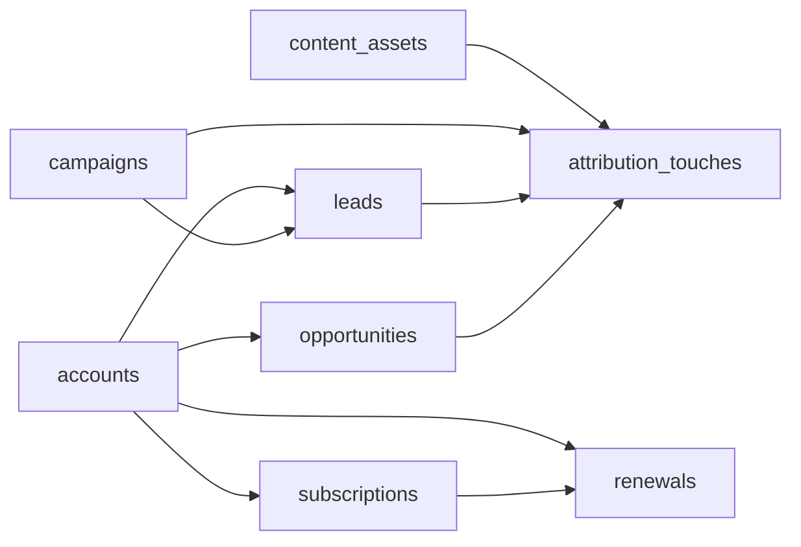

# Revenue Operations Database Lab

<p align="center">
  <strong>PostgreSQL revenue systems portfolio project</strong><br/>
  Normalized SaaS data model for pipeline, attribution, renewals, forecasting, and operating metrics.
</p>

<p align="center">
  <a href="https://www.postgresql.org/docs/"></a>
  <a href="https://www.postgresql.org/docs/current/sql.html"></a>
  <a href="https://docs.github.com/en/actions"></a>
  <a href="https://opensource.org/license/mit"></a>
</p>

> **Recruiter takeaway:** *This portfolio piece shows production-minded data modeling, revenue analytics fluency, and the ability to design the data layer underneath growth, forecast, attribution, and retention systems.*

---

## Executive Summary

RevOps Database Lab is a PostgreSQL-first portfolio project built to model the operating data behind modern SaaS revenue systems. It covers accounts, campaigns, leads, opportunities, attribution touches, subscriptions, renewals, and content influence in a normalized schema that supports executive reporting and operator workflows.

This repo is designed to look like the database layer beneath the other systems in the portfolio: revenue ops, attribution, forecasting, customer health, partner distribution, and executive dashboards.

---

## Project Overview

| Attribute | Detail |
|---|---|
| **Database** | PostgreSQL 16+ |
| **Schema Style** | 3NF-oriented normalized schema with UUID primary keys |
| **Domain** | B2B SaaS revenue operations |
| **Coverage** | Pipeline, attribution, renewals, content influence, forecast posture |
| **Seed Data** | 12 accounts · 8 campaigns · 24 leads · 14 opportunities · 10 subscriptions |
| **Artifacts** | Schema, seed data, analytics SQL, ERD, architecture notes, CI |

---

## Business Problem

Revenue organizations usually report from fragmented systems:

- CRM data captures opportunity state but not full attribution context
- campaign reporting shows activity but not pipeline quality
- renewal visibility often lives in disconnected CS spreadsheets
- content influence is rarely modeled cleanly enough for operational queries
- forecasting gets distorted when pipeline, renewal, and attribution logic are not aligned

The result is noisy reporting, weak operating leverage, and low confidence in executive numbers.

---

## Solution

This database models a practical revenue operations substrate:

- **Accounts** anchor company-level commercial context
- **Campaigns** and **content assets** capture demand generation inputs
- **Leads** represent early pipeline and acquisition motion
- **Opportunities** represent pipeline and sales execution
- **Attribution touches** make influence visible without flattening the model
- **Subscriptions** and **renewals** surface expansion, contraction, and churn exposure

The included queries translate that data into the kinds of metrics leadership teams actually use.

---

## Screenshots

### Schema Overview


### Funnel and Attribution


### Forecast and Renewals


### Query Proof


---

## Schema Architecture



### Core Tables

| Table | Purpose | Key Columns |
|---|---|---|
| `accounts` | B2B customer and prospect master | `account_id`, `industry`, `region`, `employee_count`, `account_tier` |
| `campaigns` | Demand-gen spend and channel context | `campaign_id`, `channel`, `budget`, `status`, `launch_date` |
| `content_assets` | Content influence and governance layer | `asset_id`, `asset_type`, `theme`, `owner_team`, `published_at` |
| `leads` | Acquisition-stage records | `lead_id`, `source_channel`, `stage`, `mql_date`, `sql_date` |
| `opportunities` | Pipeline and forecast records | `opportunity_id`, `stage`, `forecast_category`, `amount`, `expected_close_date` |
| `attribution_touches` | Multi-touch influence mapping | `touch_id`, `touch_position`, `touch_weight`, `touch_date` |
| `subscriptions` | Active commercial contracts | `subscription_id`, `arr_value`, `term_months`, `billing_frequency` |
| `renewals` | Renewal posture and risk | `renewal_id`, `renewal_status`, `risk_level`, `renewal_arr` |

---

## Key Design Decisions

| Decision | Rationale |
|---|---|
| **UUID primary keys** | Clean external-safe identifiers and realistic distributed-system posture |
| **Enum-backed lifecycle states** | Enforces valid lead, opportunity, and renewal transitions |
| **Separate attribution table** | Preserves campaign and content influence without denormalizing pipeline |
| **Content modeled as first-class entity** | Reflects how modern GTM teams connect content to pipeline |
| **Renewals split from subscriptions** | Keeps current contract state separate from renewal event tracking |
| **Forecast category on opportunities** | Enables commit / best-case / pipeline analysis directly in SQL |

---

## Analytics Queries

The repo includes eight business-grade SQL analyses in [sql/queries.sql](/C:/Users/chaus/Documents/Codex/repos/revops-database-lab/sql/queries.sql):

1. **Pipeline Coverage by Quarter**
2. **CAC by Campaign Channel**
3. **Lead-to-Opportunity Conversion by Campaign**
4. **Attributed Pipeline by Touch Position**
5. **Renewal Risk Exposure**
6. **Forecast Category Coverage**
7. **Content-Influenced Pipeline**
8. **Partner-Sourced Win Performance**

### Example Query

```sql
SELECT forecast_category,
       COUNT(*) AS opportunities,
       SUM(amount) AS total_pipeline
FROM opportunities
WHERE stage NOT IN ('closed_won', 'closed_lost')
GROUP BY forecast_category
ORDER BY total_pipeline DESC;
```

---

## Local Setup

### Option 1: Local PostgreSQL

```bash
createdb revops_lab
psql -d revops_lab -f sql/schema.sql
psql -d revops_lab -f sql/seed.sql
psql -d revops_lab -f sql/queries.sql
```

### Option 2: Docker

```bash
docker run --name revops-lab -e POSTGRES_PASSWORD=postgres -e POSTGRES_DB=revops_lab -p 5432:5432 -d postgres:16
psql -h localhost -U postgres -d revops_lab -f sql/schema.sql
psql -h localhost -U postgres -d revops_lab -f sql/seed.sql
psql -h localhost -U postgres -d revops_lab -f sql/queries.sql
```

---

## Validation

- GitHub Actions CI provisions PostgreSQL and runs schema, seed, and analytics SQL
- Local validation in this environment may depend on whether `psql` is installed
- The SQL artifacts are structured to run cleanly in CI against PostgreSQL 16

---

## What This Demonstrates

- normalized schema design for revenue systems
- realistic B2B SaaS seed modeling
- multi-touch attribution structure
- forecast and renewal analysis
- content and campaign influence modeling
- SQL fluency tied to business decisions, not toy examples

---

## Future Enhancements

- materialized views for executive dashboards
- dbt transformations and source freshness tests
- dimensional reporting layer for BI consumption
- synthetic monthly snapshots for trend analysis
- role-based query access examples

---

## Portfolio Links

- [Kinetic Gain](https://kineticgain.com/)
- [Skills / Portfolio](https://mizcausevic.com/skills/)
- [LinkedIn](https://www.linkedin.com/in/mirzacausevic)
- [Medium](https://medium.com/@mizcausevic)
- [GitHub](https://github.com/mizcausevic-dev)

