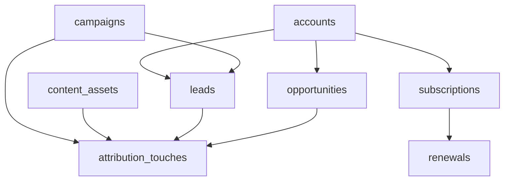

# RevOps Database Lab Architecture

## Service Overview

RevOps Database Lab is a PostgreSQL-first portfolio project that models the operational data layer behind revenue teams. It is intentionally designed as a normalized schema rather than a dashboard application so the emphasis stays on data structure, lifecycle modeling, and executive-grade SQL.

## Data Domains

- **Accounts**: company-level commercial context
- **Campaigns**: spend, source, and go-to-market motion
- **Content Assets**: owned content that can influence demand and pipeline
- **Leads**: acquisition and qualification flow
- **Opportunities**: pipeline, stage, amount, and forecast posture
- **Attribution Touches**: multi-touch influence across campaigns and content
- **Subscriptions**: active ARR-bearing commercial contracts
- **Renewals**: renewal event tracking, risk, and outcome

## Relationship Map

## Query Layer Intent

The query suite is built to answer operator and executive questions such as:

- Which channels generate efficient pipeline?
- How much open pipeline sits in each forecast category?
- What ARR is exposed to renewal risk in the next quarter?
- Which content assets are influencing pipeline creation?
- How much partner-sourced pipeline is converting to wins?

## Production-Oriented Extensions

If this were extended into a full operating system, the next steps would be:

- add dbt models and tests
- add monthly pipeline snapshot tables
- add dimensional marts for BI consumption
- implement row-level security for sensitive commercial reporting
- add CDC or ingestion jobs from CRM / MAP / billing systems

